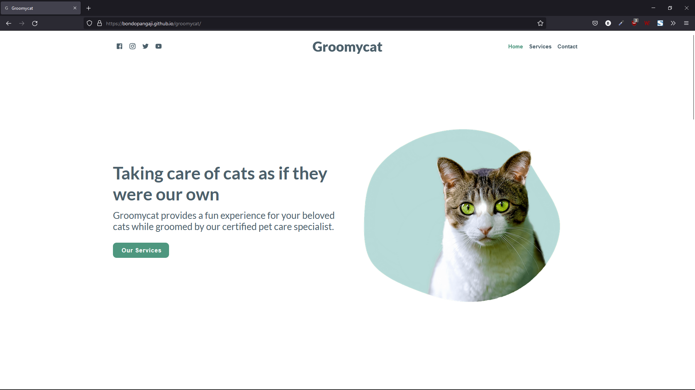

<h3 align="center">Groomycat</h3>
  

    A Landing Page Website for Cat Grooming Services
     
    [<a href="bondopangaji.github.io/groomycat/">Preview</a>]
  

<!-- TABLE OF CONTENTS -->

  
Table of Contents

  <ol>
    <li>
      <a href="#about-the-project">About The Project</a>
      <ul>
        <li><a href="#built-with">Built With</a></li>
      </ul>
    </li>
    <li><a href="#license">License</a></li>
    <li><a href="#contact">Contact</a></li>
    <li><a href="#acknowledgments">Acknowledgments</a></li>
  </ol>

<!-- ABOUT THE PROJECT -->

## About The Project

 

Groomycat is a landing page designed for pet care organizations or companies. It is implemented with HTML 5, CSS 3, Bootstrap 5, and AlpineJS. This project is intended to complete Responsive Web Design project assigned by CCIT—FTUI.

(<a href="#top">back to top</a>)

### Built With

The major frameworks/libraries that powered this project.

- [Bootstrap](https://getbootstrap.com/)
- [Alpine.js](https://alpinejs.dev/)

(<a href="#top">back to top</a>)

<!-- LICENSE -->

## License

Distributed under the MIT License. See `LICENSE.txt` for more information.

(<a href="#top">back to top</a>)

<!-- CONTACT -->

## Contact

Bondo Pangaji - [bondopangaji@gmail.com](mailto:bondopangaji@gmail.com)

Husen Minan - [husenminan11@gmail.com](mailto:husenminan11@gmail.com)

Project Link: [https://github.com/bondopangaji/groomycat](https://github.com/bondopangaji/groomycat)

(<a href="#top">back to top</a>)

<!-- ACKNOWLEDGMENTS -->

## Acknowledgments

Helpful resources.

- [Bootstrap Docs & Examples](https://getbootstrap.com/)
- [Alpine.js Docs & Examples](https://alpinejs.dev/)

(<a href="#top">back to top</a>)

<!-- REFERENCE -->
<!-- https://www.markdownguide.org/basic-syntax/#reference-style-links -->
